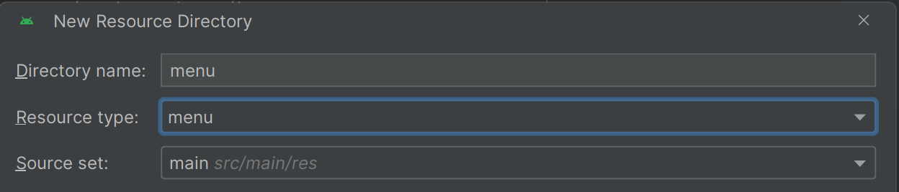
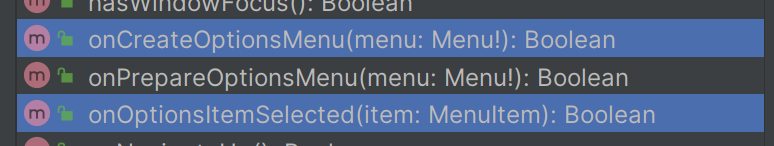
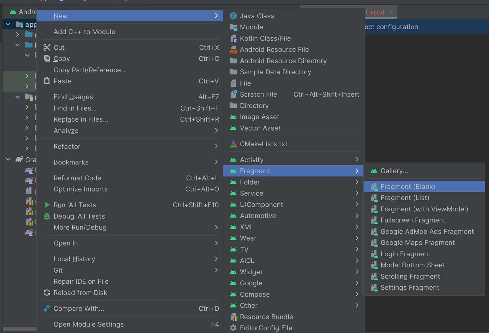

# Index
* [Chronometer](#Chronometer)
* [Dialog](#Dialog)
* [ActionBar](#ActionBar)
* [Fragment](#Fragment)

# Chronometer


# Dialog
## DatePickerDialog
```kotlin
        binding.btnDate.setOnClickListener {
            DatePickerDialog(
                this, object: DatePickerDialog.OnDateSetListener{
                    override fun onDateSet(
                        view: DatePicker?,
                        year: Int,
                        month: Int,
                        dayOfMonth: Int
                    ) {
                        // Log.d("mobileapp", "${year}년 ${month+1}월 ${dayOfMonth}일 선택됨")
                        Toast.makeText(applicationContext, "${year}년 ${month+1}월 ${dayOfMonth}일 선택됨", Toast.LENGTH_LONG).show()
                        binding.btnDate.text = "${year}년 ${month+1}월 ${dayOfMonth}일"
                        binding.btnDate.setTextColor(Color.parseColor("#ff0000"))
                        binding.btnDate.textSize = 30f
                    }

                }, 2024, 3, 3
            ).show()
        }
```
* `DatePickerDialog()` 괄호 안에 보일 내용을 기술
* `this` : 자신을 호출하는 부모 지정
* `object: DatePickerDialog.OnClickListener` : 리스너 지정
* 2024, 3(month - 1), 4 : 초기 날짜 지정
*  `show()` 메서드를 호출하여 화면에 보여야 함


## DatePickerDialog
```kotlin
        binding.btnTime.setOnClickListener {
            TimePickerDialog(
                this, object: TimePickerDialog.OnTimeSetListener{
                    override fun onTimeSet(
                        view: TimePicker?,
                        hourOfDay: Int,
                        minute: Int
                    ) {
                        Toast.makeText(applicationContext, "${hourOfDay}시 ${minute}분", Toast.LENGTH_LONG).show()
                        binding.btnTime.text = "${hourOfDay}시 ${minute}분"
                        binding.btnTime.setTextColor(Color.parseColor("#ff0000"))
                        binding.btnTime.textSize = 30f
                    }

                }, 3, 14, true
            ).show()
        }
```

## AlertDialog
```kotlin
        binding.alert.setOnClickListener {
            AlertDialog.Builder(this).run() {
                setTitle("알림창")
                setMessage("알림창입니다")
                setIcon(android.R.drawable.ic_dialog_alert)
                setPositiveButton("확인", null)
                setNegativeButton("취소", null)
                setNeutralButton("상세정보", null)
                show()
            }
        }
```
* `Builder`로 알림창을 만듦
* `setTitle(문자열)`
* `setMessage(문자열)`
* `setIcon(아이콘 경로)`
  * android.R -> android가 제공하는 resource를 사용하겠다
* `setPositiveButton(문자열, 이벤트 리스너)`
* `setNegativeButton문자열, 이벤트 리스너)`
* `setNeutralButton문자열, 이벤트 리스너)`
* `show()` : 화면에 보임 

### 이벤트 리스너 작성법
```kotlin
        val eventListener = object: DialogInterface.OnClickListener {
            override fun onClick(dialog: DialogInterface?, which: Int) {
                when(which) {
                    DialogInterface.BUTTON_POSITIVE -> {
                        Log.d("mobileapp", "BUTTON_POSITIVE")
                    }
                    DialogInterface.BUTTON_NEGATIVE -> {
                        Log.d("mobileapp", "BUTTON_NEGATIVE")
                    }
                }
            }
        }
```
* `DialogInterface`의 `OnClickListener` 구현


### items 리스트 중에서 선택할 수 있는 알림창 

🎀 `setItems()`
```kotlin
val itmes = arrayOf<String>("컴네", "컴구", "모앱", "데베")

setItems(itmes, object: DialogInterface.OnClickListener {
    override fun onClick(dialog: DialogInterface?, which: Int) {
        Toast.makeText(applicationContext, "${itmes[which]} 선택됨", Toast.LENGTH_LONG).show()
        binding.alertItem.text = "${itmes[which]} 선택됨"
    }
})
```
* `itmes` : 배열을 넣음
* `object: DialogInterface.OnClickListener` : 이벤트 리스너 구현
  * which 값은 선택한 아이템의 인덱스 번호 

🎀 `setSingleChoiceItems()`
```kotlin
setSingleChoiceItems(itmes, 2, object: DialogInterface.OnClickListener {
   override fun onClick(dialog: DialogInterface?, which: Int) {
       Toast.makeText(applicationContext, "${itmes[which]} 선택됨", Toast.LENGTH_LONG).show()
       selected = which
   }
})
```

🎀 `setMultiChoiceItems()`
```kotlin
setMultiChoiceItems(items, booleanArrayOf(true, false, false, true), object: DialogInterface.OnMultiChoiceClickListener {
       override fun onClick(dialog: DialogInterface?, which: Int, isChecked: Boolean) {
       Toast.makeText(applicationContext, "${items[which]} ${if (isChecked) "선택됨" else "취소됨"}", Toast.LENGTH_LONG).show()
           // "${if (조건) "출력할 문자1" else "출력할 문자2"}"
           // 템플릿에서 if문 사용할 수 있음 
   }
})
```
* items : 배열
* booleanArrayOf() : 초기값 지정
* object: DialogInterface.OnMultiChoiceClickListener : 이벤트 리스너 구현
  * 선택되었는지, 해제되었는지 정보를 알 수 있는 isChecked 매개변수 추가됨 

🎀 `setView(커스텀 뷰)`
```kotlin
        // xml 파일을 부로 가져옴 (dialog_custom.xml)
        val customDialog = DialogCustomBinding.inflate(layoutInflater)

        binding.alertCustom.setOnClickListener {
            AlertDialog.Builder(this).run() {
                setTitle("알림창 - 커스텀")
                setIcon(android.R.drawable.ic_dialog_alert)
                // dialog에 띄움
                setView(customDialog.root)
                setPositiveButton("확인", eventListener2)
                setNegativeButton("취소", eventListener)
                setNeutralButton("상세정보", eventListener)
                show()
            }
        }
```

* 커스텀 다이얼로그에서 이벤트 리스너 작성하는 법
```kotlin
        val eventListener3 = object: DialogInterface.OnClickListener {
            override fun onClick(dialog: DialogInterface?, which: Int) {
                when(which) {
                    // 확인 버튼을 눌렀을 경우
                    DialogInterface.BUTTON_POSITIVE -> {
                        // 커스텀 다이얼로그 항목 중 어느 것이 선택되었는지 확인
                        if(customDialog.rbn1.isChecked) // 각각의 요소에 접근해서 선택 확인 
                            Toast.makeText(applicationContext, "${customDialog.rbn1.text.toString()}", Toast.LENGTH_LONG).show()

                        else if(customDialog.rbn2.isChecked)
                            Toast.makeText(applicationContext, "${customDialog.rbn2.text.toString()}", Toast.LENGTH_LONG).show()

                        else if(customDialog.rbn3.isChecked)
                            Toast.makeText(applicationContext, "${customDialog.rbn3.text.toString()}", Toast.LENGTH_LONG).show()

                        else if(customDialog.rbn4.isChecked)
                            Toast.makeText(applicationContext, "${customDialog.rbn4.text.toString()}", Toast.LENGTH_LONG).show()
                    }
                }
            }
        }
```

# ActionBar
## 액션 바 출력 설정
```kotlin
// res/values/themes에서 NoActionBar 제거 
<style name="Base.Theme.Practice" parent="Theme.Material3.DayNight.NoActionBar">
```

* menu 라는 이름으로 menu 리소스 디렉터리 생성


## 메뉴 구성
```xml
<?xml version="1.0" encoding="utf-8"?>
<menu xmlns:android="http://schemas.android.com/apk/res/android"
    xmlns:app="http://schemas.android.com/apk/res-auto">
    <!--showAsAction = true : 항상 화면에 보임 -->
    <!-- SearchView를 지정해줌으로서 화면에 띄울 수 있음 -->
    <item
        android:id="@+id/menu_search"
        android:title="search"
        app:actionViewClass="androidx.appcompat.widget.SearchView"
        app:showAsAction="always"
        />

    <!-- 메뉴 안쪽에 보임 -->
    <item
        android:id="@+id/item1"
        android:title="아이템1"/>
    <item
        android:id="@+id/item2"
        android:title="아이템2"/>
    <item
        android:id="@+id/item3"
        android:title="아이템3"/>
    <item
        android:id="@+id/item4"
        android:title="아이템4"/>

</menu>
```

* `onCreateOptionMenu`를 통해 메뉴 띄움
* `onOptionsItemSelected`를 통해 메뉴 선택 시 기능 수행 

### onCreateOptionsMenu
```kotlin
    // 아이템을 클릭하면 onOptionsItemSelected 함수가 자동으로 호출된다
    override fun onCreateOptionsMenu(menu: Menu?): Boolean {
        menuInflater.inflate(R.menu.menu_navigation, menu) // res/menu/menu_navigation.xml 파일을 menu로 등록하겠다
        val searchView = menu?.findItem(R.id.menu_search)?.actionView as SearchView // menu_navigation.xml 파일의 menu_search를 가져옴

        // 검색 관련 이벤트 리스너
        searchView.setOnQueryTextListener(object: SearchView.OnQueryTextListener {
            // 검색 버튼 누를 경우 이벤트 리스너
            override fun onQueryTextSubmit(query: String?): Boolean {
                Toast.makeText(applicationContext, "${query} 검색합니다.", Toast.LENGTH_LONG).show()
                return true
            }

            // 검색 중 이벤트 리스너
            override fun onQueryTextChange(newText: String?): Boolean {
                return true
            }
        })
        return super.onCreateOptionsMenu(menu)
    }
```

### onOptionsItemSelected
```kotlin
override fun onOptionsItemSelected(item: MenuItem): Boolean {
        when(item.itemId) { // 선택된 아이템 비교
            R.id.item1 -> {
                binding.btnDate.setTextColor(Color.parseColor("#00FF00"))
            }
            R.id.item2 -> {

            }
            R.id.item3 -> {

            }
            R.id.item4 -> {

            }
        }
        return super.onOptionsItemSelected(item)
    }
```

#### 📌 뷰 전역변수로 선언해서 다른 함수에서 불러오는 방법
```kotlin
// 클래스 바로 아래에
lateinit var binding: ActivityMainBinding

// onCreate 함수 아래에
binding = ActivityMainBinding.inflate(layoutInflater)
setContentView(binding.root)
```

# Drawer
* Drawer 태그로 전체를 감싸줌 -> id 설정까지 진행해주기 
* 폰의 화면 크기에 맞춰 보여주기 위해 fitsSystemWindows true로 설정하기 
```xml
<androidx.drawerlayout.widget.DrawerLayout  xmlns:android="http://schemas.android.com/apk/res/android"
    xmlns:app="http://schemas.android.com/apk/res-auto"
    android:layout_width="match_parent"
    android:layout_height="match_parent"

    xmlns:tools="http://schemas.android.com/tools"
    tools:context=".MainActivity"

    android:id="@+id/drawer"
    android:fitsSystemWindows="true"
    >
    
</androidx.drawerlayout.widget.DrawerLayout>
```
```xml
<!-- drawer 가 출력될 자리 -->
<TextView
        android:layout_width="300dp"
        android:layout_height="match_parent"
        android:text="I am drawer"
        android:background="#ff0000"
        android:textColor="#ffffff"
        android:textSize="20dp"
        android:textStyle="bold"
        android:gravity="center"

        android:fitsSystemWindows="true"
        android:layout_gravity="start"
/>
```
* `android:fitsSystemWindows="true"`로 폰의 화면 크기에 맞춰서 보이도록 설정
* `android:layout_gravity="start"` 로 왼쪽에서 오른쪽으로 끌어올 수 있도록 함 

```kotlin
lateinit var toggle: ActionBarDrawerToggle // 초기 선언

// onStart 함수 내부에 아래 코드 작성 
// drawer와 toggle 연결 - 클릭했을 때 동작하는 부분은 빠져 있음
toggle = ActionBarDrawerToggle(this, binding.drawer, R.string.drawaer_opened, R.string.drawer_closed)
supportActionBar?.setDisplayHomeAsUpEnabled(true) // 화면에 보여짐
toggle.syncState()

override fun onOptionsItemSelected(item: MenuItem): Boolean {
  if(toggle.onOptionsItemSelected(item)) { // 토굴이 클릭될때마다 이 함수가 실행됨
    return true // 토굴의 본래 기능을 실행해라
  }
  // 아래 코드 생략
  return super.onOptionsItemSelected(item)
}
```

# Fragment
* build.graddle에서 `implementation("androidx.viewpager2:viewpager2:1.0.0")` 추가 

* Fragment와 xml 파일이 생성됨

```xml
<?xml version="1.0" encoding="utf-8"?>
<androidx.viewpager2.widget.ViewPager2 xmlns:android="http://schemas.android.com/apk/res/android"
    xmlns:app="http://schemas.android.com/apk/res-auto"
    xmlns:tools="http://schemas.android.com/tools"
    android:layout_width="match_parent"
    android:layout_height="match_parent"
    android:id="@+id/viewpaper"
    tools:context=".MainActivity">

    <!-- 내용 채우기 -->
</androidx.viewpager2.widget.ViewPager2>
```
* 생성된 xml 파일에서는 binding으로 접근할 수 있도록 루트 태그에 `id값을 부여`해야 함
* implement 한 `ViewPaper2`로 루트 바꿔주기 

```kotlin
    // Fragment.kt

    override fun onCreateView(
        inflater: LayoutInflater, container: ViewGroup?,
        savedInstanceState: Bundle?
    ): View? {
        // Inflate the layout for this fragment
        val binding = FragmentOneBinding.inflate(inflater, container, false)
        /**
         * view에서의 동작을 넣어줌 
         */
        return inflater.inflate(R.layout.fragment_one, container, false)
    }
```
* Fragment 파일의 onCreateView에 동작 정의
```kotlin
// MainActivity.kt

class MainActivity : AppCompatActivity() {
  lateinit var binding: ActivityMainBinding

  // FragmentStateAdapter를 상속받는 MyFragmentPagerAdapter 클래스를 생성함
  class MyFragmentAdapter(activity: FragmentActivity): FragmentStateAdapter(activity) {
    // 어떤 fragement를 다룰 것인지 변수를 선언해둠
    val fragments: List<Fragment>

    init {
      fragments = listOf(OneFragment(), TwoFragment(), ThreeFragment()) // 3개의 Fragment를 리스트로 담고 있음
    }
    override fun getItemCount(): Int {
      return fragments.size
    }

    override fun createFragment(position: Int): Fragment {
      return fragments[position]
    }

  }
  override fun onCreate(savedInstanceState: Bundle?) {
    super.onCreate(savedInstanceState)
    // setContentView(R.layout.activity_main)

    binding = ActivityMainBinding.inflate(layoutInflater)
    setContentView(binding.root)

    binding.viewpaper.adapter = MyFragmentAdapter(this)
  }
}
```